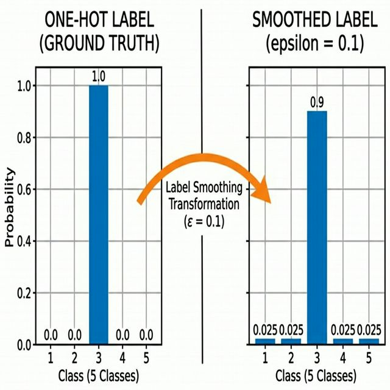
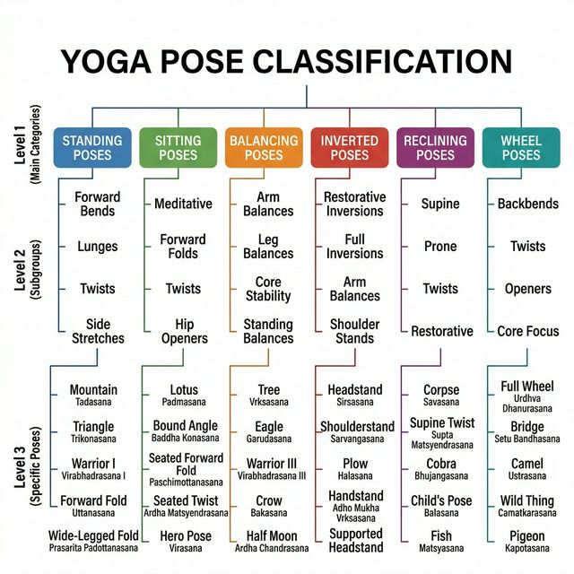
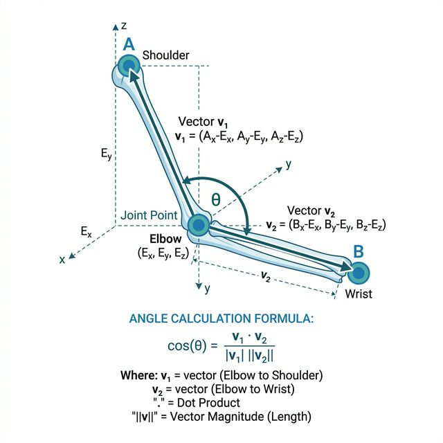
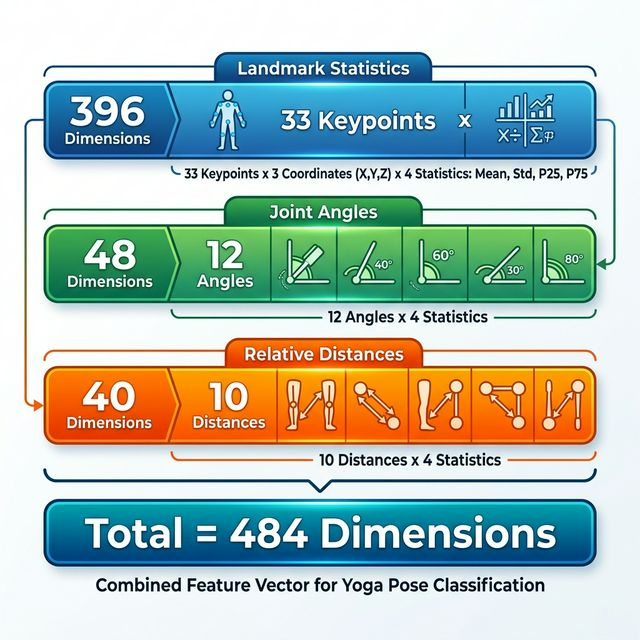
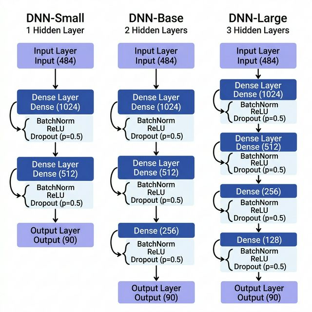
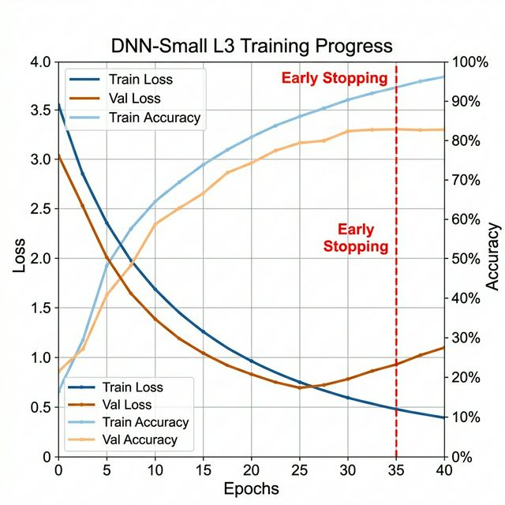
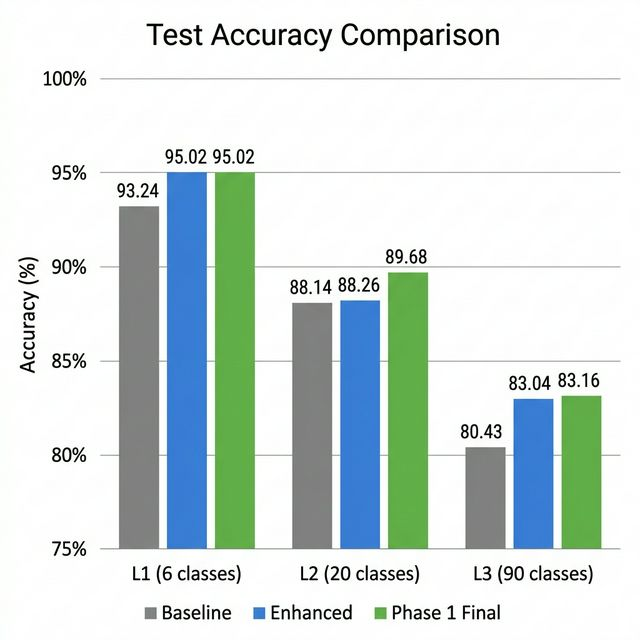
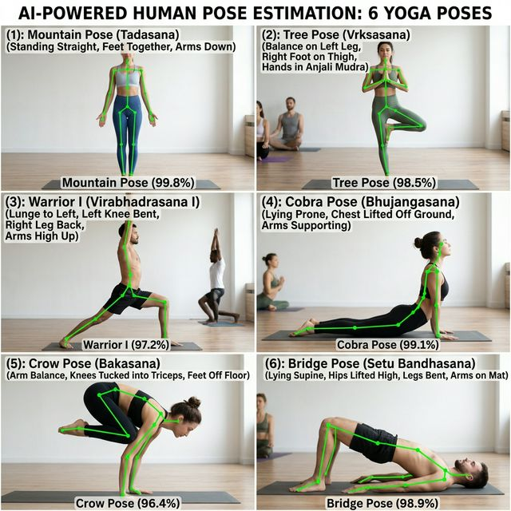

# BÁO CÁO PROJECT MÔN HỌC

# HỆ THỐNG NHẬN DIỆN TƯ THẾ YOGA ĐA CẤP ĐỘ SỬ DỤNG MẠNG NƠ-RON SÂU DNN VÀ BỘ DỮ LIỆU 3DYoga90

---

**Nhóm thực hiện:** Squat Hero AI Team  

---

## MỤC LỤC

1. [Giới thiệu đề tài](#1-giới-thiệu-đề-tài)
2. [Cơ sở lý thuyết](#2-cơ-sở-lý-thuyết)
3. [Bộ dữ liệu 3DYoga90](#3-bộ-dữ-liệu-3dyoga90)
4. [Kiến trúc hệ thống](#4-kiến-trúc-hệ-thống)
5. [Trích xuất đặc trưng](#5-trích-xuất-đặc-trưng)
6. [Kiến trúc mô hình DNN](#6-kiến-trúc-mô-hình-dnn)
7. [Huấn luyện mô hình](#7-huấn-luyện-mô-hình)
8. [Kết quả thực nghiệm](#8-kết-quả-thực-nghiệm)
9. [Ứng dụng demo](#9-ứng-dụng-demo)
10. [Kết luận và hướng phát triển](#10-kết-luận-và-hướng-phát-triển)
11. [Tài liệu tham khảo](#11-tài-liệu-tham-khảo)
12. [Phụ lục](#12-phụ-lục)

---

## 1. Giới Thiệu Đề Tài

### 1.1. Đặt vấn đề

Yoga là hình thức tập luyện phổ biến toàn cầu, mang lại nhiều lợi ích cho sức khỏe thể chất và tinh thần. Tuy nhiên, trong quá trình tự tập luyện tại nhà, người tập thường không có người hướng dẫn chuyên nghiệp để kiểm tra tính đúng đắn của tư thế, dẫn đến nguy cơ chấn thương hoặc tập luyện không hiệu quả.

Với sự phát triển của trí tuệ nhân tạo (AI) và thị giác máy tính (Computer Vision), việc xây dựng một hệ thống tự động nhận diện tư thế yoga từ camera thường trở nên khả thi, giúp người tập nhận được phản hồi tức thời mà không cần thiết bị cảm biến đắt tiền.

### 1.2. Mục tiêu dự án

- Xây dựng hệ thống AI nhận diện **90 tư thế yoga** theo cấu trúc phân cấp 3 cấp độ (L1 → L2 → L3).
- Đạt độ chính xác **trên 80%** ở cấp độ phân loại chi tiết nhất (L3 — 90 tư thế).
- Hệ thống chạy **thời gian thực (real-time)** trên webcam laptop thông thường.
- Hỗ trợ phân tích video local và video từ YouTube.

### 1.3. Phạm vi dự án

- **Bộ dữ liệu:** 3DYoga90 — 5.526 chuỗi video skeleton, 90 tư thế chuẩn xác.
- **Mô hình:** Mạng Nơ-ron Sâu (DNN) với 3 biến thể: Small, Base, Large.
- **Framework:** PyTorch + MediaPipe + OpenCV.
- **Nền tảng triển khai:** Máy tính cá nhân (Windows/Linux), hỗ trợ GPU CUDA.


---

## 2. Cơ Sở Lý Thuyết

### 2.1. Bài toán nhận diện tư thế (Pose Recognition)

Nhận diện tư thế người (Human Pose Recognition) là bài toán phân loại trong thị giác máy tính, trong đó hệ thống cần xác định tư thế hiện tại của người dùng dựa trên hình ảnh hoặc video đầu vào. Bài toán này bao gồm hai giai đoạn:

1. **Ước lượng tư thế (Pose Estimation):** Xác định vị trí các khớp trên cơ thể người.
2. **Phân loại tư thế (Pose Classification):** Từ vị trí các khớp → dự đoán tên tư thế.

### 2.2. MediaPipe BlazePose

**MediaPipe BlazePose** là mô hình ước lượng tư thế của Google, có khả năng nhận diện **33 điểm mốc (keypoints/landmarks)** trên cơ thể người trong thời gian thực trên CPU.

Mỗi keypoint có 3 tọa độ trong không gian 3D:

- **x:** tọa độ ngang (0 = trái, 1 = phải)
- **y:** tọa độ dọc (0 = trên, 1 = dưới)
- **z:** độ sâu (khoảng cách tương đối với camera)

Như vậy, mỗi khung hình (frame) sẽ được biểu diễn bằng **33 × 3 = 99 giá trị số thực**.

Sơ đồ bố trí 33 keypoints trên cơ thể người (nhìn từ phía trước):

```
                    Nose (0)
               /     |     \
          L_Eye   R_Eye   L_Ear  R_Ear
          (1-2)   (3-4)    (7)    (8)
                   |
            L_Shoulder ─── R_Shoulder
              (11)    |      (12)
               |      |       |
           L_Elbow    |    R_Elbow
             (13)     |     (14)
               |      |       |
           L_Wrist    |    R_Wrist
             (15)     |     (16)
               |      |       |
           L_Pinky    |    R_Pinky
           (17-22)    |   (17-22)
                      |
              L_Hip ──┼── R_Hip
              (23)    |    (24)
               |      |      |
            L_Knee    |   R_Knee
              (25)    |    (26)
               |      |      |
           L_Ankle    |   R_Ankle
              (27)    |    (28)
               |      |      |
           L_Foot     |   R_Foot
           (29-32)         (29-32)
```

**Bảng 2.1: Danh sách 33 keypoints của BlazePose**

| Nhóm | ID | Tên keypoint |
|------|-----|-------------|
| Đầu/Mặt | 0 | Mũi (Nose) |
| | 1–4 | Mắt trái/phải (inner, outer) |
| | 5–6 | Tai trái/phải |
| | 7–8 | Miệng trái/phải |
| Thân trên | 11–12 | Vai trái/phải |
| | 13–14 | Khuỷu tay trái/phải |
| | 15–16 | Cổ tay trái/phải |
| | 17–22 | Ngón tay trái/phải |
| Thân dưới | 23–24 | Hông trái/phải |
| | 25–26 | Đầu gối trái/phải |
| | 27–28 | Mắt cá chân trái/phải |
| | 29–32 | Bàn chân trái/phải |

### 2.3. Mạng Nơ-Ron Sâu (DNN — Deep Neural Network)

DNN là kiến trúc mạng nơ-ron bao gồm nhiều lớp kết nối đầy đủ (Fully Connected / Dense layers) xếp chồng lên nhau. Mỗi lớp thực hiện phép biến đổi tuyến tính, sau đó áp dụng hàm kích hoạt phi tuyến.

Các thành phần chính trong khối DNN:

| Thành phần | Chức năng |
|---|---|
| **Dense (Linear) Layer** | Nhân ma trận trọng số: $y = Wx + b$ |
| **Batch Normalization** | Chuẩn hóa đầu ra theo từng mini-batch, giúp quá trình học ổn định hơn |
| **ReLU** | Hàm kích hoạt: $f(x) = \max(0, x)$, cho phép mạng học mối quan hệ phi tuyến |
| **Dropout** | Ngẫu nhiên "tắt" một tỉ lệ nơ-ron khi huấn luyện, chống hiện tượng quá khớp (overfitting) |
| **Softmax** | Chuyển đổi vector đầu ra thành phân phối xác suất: $P(i) = \frac{e^{z_i}}{\sum_j e^{z_j}}$ |

### 2.4. Hàm mất mát (Loss Function)

#### 2.4.1. Cross Entropy Loss

Hàm Cross Entropy đo lường khoảng cách giữa phân phối xác suất dự đoán và nhãn thật:

$$\mathcal{L}_{CE} = -\sum_{i=1}^{C} y_i \log(\hat{y}_i)$$

Trong đó $C$ là số lớp, $y_i$ là nhãn thật (one-hot), $\hat{y}_i$ là xác suất dự đoán.

#### 2.4.2. Weighted Cross Entropy

Khi dữ liệu mất cân bằng, các lớp hiếm có ít mẫu huấn luyện hơn, dẫn đến mô hình thiên vị các lớp phổ biến. **Weighted Cross Entropy** giải quyết bằng cách gán trọng số nghịch tần suất:

$$w_i = \frac{N_{total}}{N_i \times C}$$

$$\mathcal{L}_{WCE} = -\sum_{i=1}^{C} w_i \cdot y_i \log(\hat{y}_i)$$

Hiệu ứng: Mô hình bị phạt nặng hơn khi phân loại sai các tư thế hiếm.

#### 2.4.3. Label Smoothing

Label Smoothing làm mềm nhãn one-hot bằng cách phân phối một phần xác suất nhỏ cho các lớp khác:

$$y_i^{smooth} = (1 - \epsilon) \cdot y_i + \frac{\epsilon}{C}$$

Với $\epsilon = 0.1$, nhãn đúng nhận giá trị 0.9 thay vì 1.0, giúp mô hình không quá tự tin (overconfident) và tổng quát hóa tốt hơn.



---

## 3. Bộ Dữ Liệu 3DYoga90

### 3.1. Tổng quan

Bộ dữ liệu **3DYoga90** được công bố trong bài báo *"3DYoga90: A Hierarchical Video Dataset for Yoga Pose Understanding"* (arXiv:2310.10131). Đây là bộ dữ liệu chuẩn (benchmark) cho bài toán nhận diện tư thế yoga.

**Bảng 3.1: Thông số bộ dữ liệu 3DYoga90**

| Thông số | Giá trị |
|----------|---------|
| Tổng số chuỗi (sequences) | 5.526 |
| Tập huấn luyện (train) | 4.683 (84,7%) |
| Tập kiểm tra (test) | 843 (15,3%) |
| Tập xác thực (validation) | ~468 (10% từ train) |
| Nguồn skeleton | BlazePose (33 keypoints × 3D) |
| Định dạng lưu trữ | Apache Parquet |
| Số tư thế L1 | 6 danh mục |
| Số tư thế L2 | 20 nhóm |
| Số tư thế L3 | 90 tư thế cụ thể |

### 3.2. Hệ thống phân cấp 3 mức (Hierarchical Classification)

Bộ dữ liệu tổ chức 90 tư thế yoga theo cây phân cấp 3 cấp độ:

```
Level 1 (6 danh mục)          Level 2 (20 nhóm)                Level 3 (90 tư thế)
├── Standing (Đứng)       ──→  standing-straight           ──→  mountain, tree, warrior I, ...
├── Sitting (Ngồi)        ──→  sitting-legs-front          ──→  cobbler, staff, boat, ...
├── Balancing (Thăng bằng) ──→ balancing-arm               ──→  crow, firefly, ...
├── Inverted (Đảo ngược)  ──→  inverted-legs-up            ──→  headstand, shoulderstand, ...
├── Reclining (Nằm)       ──→  reclining-face-up           ──→  corpse, bridge, ...
└── Wheel (Uốn cong)      ──→  wheel-up-facing             ──→  cobra, upward-dog, ...
```



### 3.3. Vấn đề mất cân bằng dữ liệu (Imbalanced Data)

Bộ dữ liệu 3DYoga90 có sự mất cân bằng đáng kể giữa các lớp:

- Một số tư thế phổ biến có hàng trăm mẫu huấn luyện.
- Một số tư thế hiếm chỉ có vài chục mẫu.

Sự mất cân bằng này gây ra hiện tượng **điểm mù (blind spots)**: mô hình luôn đoán tư thế phổ biến cho an toàn, khiến một số tư thế hiếm có **F1-score = 0%** (không bao giờ được nhận diện đúng).

Phân tích thống kê phân phối mẫu theo danh mục L1 (6 nhóm):

| Danh mục L1 | Số lượng mẫu | Tỷ lệ | Đặc điểm |
|-------------|:------------:|:------:|----------|
| Standing (Đứng) | ~1.800 | 32,6% | Nhóm lớn nhất — nhiều biến thể (warrior, tree, triangle...) |
| Sitting (Ngồi) | ~1.200 | 21,7% | Nhóm lớn thứ 2 |
| Balancing (Thăng bằng) | ~700 | 12,7% | Nhóm trung bình |
| Inverted (Đảo ngược) | ~600 | 10,9% | Nhóm nhỏ — tư thế khó |
| Reclining (Nằm) | ~650 | 11,8% | Nhóm trung bình |
| Wheel (Uốn cong) | ~576 | 10,4% | Nhóm nhỏ nhất |

Ở cấp độ L3 (90 tư thế), sự mất cân bằng trầm trọng hơn:

- **Tư thế phổ biến nhất:** ~150–200 mẫu (ví dụ: mountain, warrior I)
- **Tư thế hiếm nhất:** chỉ 15–30 mẫu (ví dụ: tulasana, firefly)
- **Tỷ lệ chênh lệch:** lớp lớn nhất gấp **~10 lần** lớp nhỏ nhất
- Đây là nguyên nhân chính gây ra hiện tượng blind spots (F1=0%) ở phiên bản Baseline

---

## 4. Kiến Trúc Hệ Thống

### 4.1. Tổng quan pipeline

Hệ thống hoạt động theo 5 giai đoạn nối tiếp:

```
┌──────────────┐     ┌──────────────────┐     ┌───────────────────┐
│  Video Input │ ──→ │  MediaPipe        │ ──→ │  Feature           │
│  (Webcam/    │     │  BlazePose        │     │  Extraction        │
│   YouTube/   │     │  33 keypoints ×3D │     │  484-dim vector    │
│   Local)     │     │  mỗi frame        │     │                    │
└──────────────┘     └──────────────────┘     └─────────┬─────────┘
                                                         │
                                                         ▼
                     ┌──────────────────┐     ┌───────────────────┐
                     │  Kết Quả Hiển    │ ←── │  DNN-Small Model  │
                     │  Thị Trên Màn    │     │  Softmax → xác    │
                     │  Hình            │     │  suất mỗi class   │
                     │  L1: Standing    │     │                    │
                     │  L2: Warrior     │     │  Input: 484-dim   │
                     │  L3: Warrior II  │     │  Output: n_classes │
                     └──────────────────┘     └───────────────────┘
```


### 4.2. Chi tiết từng giai đoạn

#### Giai đoạn 1: Thu nhận video (Video Input)

- Hệ thống hỗ trợ 3 nguồn đầu vào: Webcam thời gian thực, video local, video YouTube (tải qua `yt-dlp`).
- Mỗi giây video chứa khoảng 30 khung hình (frames) ở 30 fps.

#### Giai đoạn 2: Ước lượng tư thế (Pose Estimation)

- Sử dụng **MediaPipe PoseLandmarker (Full)** để trích xuất 33 keypoints 3D mỗi frame.
- Model chạy trên CPU với tốc độ real-time.

#### Giai đoạn 3: Trích xuất đặc trưng (Feature Extraction)

- Gom 60 frame liên tiếp (khoảng 2 giây) qua cơ chế **Rolling Window**.
- Tính toán vector đặc trưng 484 chiều (chi tiết ở Mục 5).

#### Giai đoạn 4: Phân loại bằng DNN (Classification)

- Vector 484 chiều → 3 model DNN riêng biệt (L1, L2, L3) → xác suất từng tư thế.

#### Giai đoạn 5: Hiển thị kết quả (Visualization)

- Vẽ skeleton overlay lên video.
- Hiển thị tên tư thế + confidence bar 3 cấp độ.

---

## 5. Trích Xuất Đặc Trưng (Feature Extraction)

### 5.1. Động cơ thiết kế

Mạng DNN cần đầu vào kích thước cố định, nhưng mỗi video có số frame khác nhau. Do đó, chúng tôi **tổng hợp (aggregate)** thông tin từ toàn bộ chuỗi frame thành một vector thống kê có kích thước cố định.

Hệ thống trải qua 2 phiên bản:

- **V1 (Baseline):** 198 chiều — chỉ dùng Mean + Std của tọa độ.
- **V2 (Enhanced):** 484 chiều — bổ sung Percentile, Góc khớp, Khoảng cách.

### 5.2. Thành phần Feature Vector V2 (484 chiều)

#### A. Thống kê tọa độ Landmark (396 chiều)

Với mỗi tọa độ trong 99 giá trị (33 keypoints × 3 tọa độ), tính 4 thống kê qua toàn bộ frame:

| Thống kê | Ý nghĩa sinh học | Số chiều |
|----------|------------------|----------|
| **Mean** (trung bình) | Vị trí "trung tâm" của keypoint trong suốt video | 99 |
| **Std** (độ lệch chuẩn) | Mức độ dao động / chuyển động | 99 |
| **Percentile 25%** | Biên dưới của phạm vi chuyển động | 99 |
| **Percentile 75%** | Biên trên của phạm vi chuyển động | 99 |

**Tổng: 99 × 4 = 396 chiều**

#### B. Góc khớp — Joint Angles (48 chiều)

Tính góc tại 12 khớp quan trọng cho mỗi frame bằng phép toán vector:

**Công thức tính góc:**

```
v1 = PointA − JointPoint
v2 = PointB − JointPoint
cos(θ) = (v1 · v2) / (|v1| × |v2|)
θ_normalized = arccos(cos(θ)) / π     →  giá trị trong [0, 1]
```

**Bảng 5.1: 12 góc khớp được tính toán**

| # | Tên khớp | Điểm A | Điểm trụ (Joint) | Điểm B |
|---|----------|--------|-------------------|--------|
| 1 | Khuỷu tay trái | Vai trái | Khuỷu trái | Cổ tay trái |
| 2 | Khuỷu tay phải | Vai phải | Khuỷu phải | Cổ tay phải |
| 3 | Đầu gối trái | Hông trái | Đầu gối trái | Mắt cá trái |
| 4 | Đầu gối phải | Hông phải | Đầu gối phải | Mắt cá phải |
| 5 | Vai trái | Khuỷu trái | Vai trái | Hông trái |
| 6 | Vai phải | Khuỷu phải | Vai phải | Hông phải |
| 7 | Hông trái | Vai trái | Hông trái | Đầu gối trái |
| 8 | Hông phải | Vai phải | Hông phải | Đầu gối phải |
| 9 | Mắt cá trái | Hông trái | Mắt cá trái | Đầu gối trái |
| 10 | Mắt cá phải | Hông phải | Mắt cá phải | Đầu gối phải |
| 11 | Cột sống trái | Mũi | Vai trái | Hông trái |
| 12 | Cột sống phải | Mũi | Vai phải | Hông phải |

Mỗi góc × 4 thống kê (Mean, Std, P25, P75) → **12 × 4 = 48 chiều**



#### C. Khoảng cách tương đối — Relative Distances (40 chiều)

Tính khoảng cách Euclidean giữa 10 cặp keypoint mang ý nghĩa sinh học:

**Bảng 5.2: 10 cặp khoảng cách**

| # | Cặp keypoint | Ý nghĩa tư thế |
|---|-------------|-----------------|
| 1 | Cổ tay trái ↔ Cổ tay phải | Độ dang rộng tay |
| 2 | Mắt cá trái ↔ Mắt cá phải | Độ dang rộng chân |
| 3 | Cổ tay trái ↔ Mắt cá trái | Gập bên trái |
| 4 | Cổ tay phải ↔ Mắt cá phải | Gập bên phải |
| 5 | Cổ tay trái ↔ Mắt cá phải | Xoay/vặn cơ thể |
| 6 | Cổ tay phải ↔ Mắt cá trái | Xoay/vặn cơ thể |
| 7 | Mũi ↔ Hông trái | Cúi/ngửa thân trái |
| 8 | Mũi ↔ Hông phải | Cúi/ngửa thân phải |
| 9 | Vai trái ↔ Hông phải | Xoay thân trên/dưới |
| 10 | Vai phải ↔ Hông trái | Xoay thân trên/dưới |

Mỗi khoảng cách × 4 thống kê → **10 × 4 = 40 chiều**

#### D. Tổng kết Feature Vector

```
Feature Vector V2 = Landmarks (396) + Angles (48) + Distances (40) = 484 chiều
```



---

## 6. Kiến Trúc Mô Hình DNN

### 6.1. Ba biến thể mô hình

Chúng tôi xây dựng 3 biến thể mô hình DNN với độ phức tạp tăng dần:

```
                DNN-Small              DNN-Base               DNN-Large
                ─────────              ─────────              ──────────
Input (484) ──→ Dense(1024)        ──→ Dense(1024)        ──→ Dense(1024)
                ↓ BN+ReLU+Drop(0.4)    ↓ BN+ReLU+Drop(0.4)    ↓ BN+ReLU+Drop(0.4)
                Dense(512)             Dense(512)             Dense(512)
                ↓ BN+ReLU+Drop(0.4)    ↓ BN+ReLU+Drop(0.4)    ↓ BN+ReLU+Drop(0.4)
                Dense(n_classes)       Dense(256)             Dense(256)
                                       ↓ BN+ReLU+Drop(0.4)    ↓ BN+ReLU+Drop(0.4)
                                       Dense(n_classes)       Dense(128)
                                                              ↓ BN+ReLU+Drop(0.4)
                                                              Dense(n_classes)
```

**Bảng 6.1: So sánh 3 biến thể DNN**

| Đặc điểm | DNN-Small | DNN-Base | DNN-Large |
|-----------|-----------|----------|-----------|
| Số lớp ẩn | 2 | 3 | 4 |
| Kích thước lớp | 1024 → 512 | 1024 → 512 → 256 | 1024 → 512 → 256 → 128 |
| Số tham số (L3) | ~1.08M | ~1.21M | ~1.25M |
| Tốc độ inference | Nhanh nhất | Trung bình | Chậm nhất |
| Đặc điểm | Phù hợp real-time | Cân bằng | Dễ overfitting |



### 6.2. Lý do chọn DNN-Small cho triển khai

Mô hình **DNN-Small** được chọn làm mô hình triển khai chính vì:

1. **Tốc độ cao:** Inference nhanh nhất, phù hợp real-time trên CPU.
2. **Hiệu quả đặc trưng:** Enhanced features (484-dim) đã đủ informative, mạng nhỏ tận dụng tốt hơn mà không bị overfitting.
3. **Accuracy tốt nhất:** Đạt accuracy cao nhất ở L1 và L3 sau khi nâng cấp features.

---

## 7. Huấn Luyện Mô Hình

### 7.1. Cấu hình huấn luyện

**Bảng 7.1: Siêu tham số huấn luyện**

| Siêu tham số | Giá trị | Giải thích |
|--------------|---------|------------|
| Optimizer | Adam | Thuật toán tối ưu adaptive learning rate |
| Learning Rate | 3.33 × 10⁻⁴ | Tốc độ học ban đầu |
| LR Scheduler | ReduceLROnPlateau | Tự giảm LR × 0.8 khi val_acc không cải thiện sau 5 epoch |
| Batch Size | 256 | Số mẫu xử lý cùng lúc |
| Max Epochs | 100 | Số vòng lặp huấn luyện tối đa |
| Early Stopping | patience = 10 | Dừng huấn luyện nếu val_acc không cải thiện sau 10 epoch |
| Dropout | 0.4 | Tỉ lệ tắt ngẫu nhiên nơ-ron khi huấn luyện |
| Validation Split | 10% từ train | ~468 mẫu dùng để đánh giá trong quá trình train |
| Loss Function | Weighted CrossEntropy + Label Smoothing (ε=0.1) | Cân bằng dữ liệu + chống overconfident |

### 7.2. Quá trình huấn luyện

```
Vòng lặp huấn luyện (1 epoch = duyệt toàn bộ ~4.215 mẫu train):

1. Chia dữ liệu train thành các mini-batch (256 mẫu/batch)
2. Forward Pass: Đưa batch qua mạng DNN → nhận xác suất dự đoán
3. Tính Loss: So sánh dự đoán với nhãn thật bằng Weighted CrossEntropy
4. Backward Pass: Lan truyền ngược lỗi → tính gradient cho từng trọng số
5. Update: Optimizer Adam cập nhật trọng số theo gradient
6. Validation: Cuối mỗi epoch, đánh giá trên tập validation
7. Checkpoint: Lưu mô hình tốt nhất theo val_accuracy
8. Early Stopping: Dừng nếu không cải thiện sau 10 epoch liên tiếp
```



### 7.3. Kỹ thuật cải tiến (Phase 1)

#### 7.3.1. Vấn đề của phiên bản Baseline

Phiên bản Baseline sử dụng feature 198-dim và CrossEntropy thường gặp các vấn đề:

- Nhiều tư thế hiếm có **F1-score = 0%** (hoàn toàn không nhận diện được).
- Mô hình thiên vị đoán các tư thế phổ biến.
- Ví dụ: Tư thế *tulasana* luôn bị nhầm thành *tolasana*, tư thế *utthita ashwa sanchalanasana* không bao giờ được dự đoán đúng.

#### 7.3.2. Giải pháp đã áp dụng

| Kỹ thuật | Mục đích | Cách hoạt động |
|----------|----------|----------------|
| **Enhanced Features (484-dim)** | Cung cấp thông tin phong phú hơn | Bổ sung Percentile, Góc khớp, Khoảng cách →  giúp phân biệt tư thế tương tự |
| **Weighted Cross Entropy** | Cân bằng dữ liệu | Trọng số tỷ lệ nghịch tần suất → phạt nặng khi nhận diện sai tư thế hiếm |
| **Label Smoothing (ε=0.1)** | Chống overconfident | Nhãn đúng = 0.9 thay vì 1.0 → mô hình linh hoạt hơn |
| **Data Augmentation** | Tăng đa dạng dữ liệu | Gaussian noise (σ=0.01) + random scale (0.9–1.1) cho distance features |

---

## 8. Kết Quả Thực Nghiệm

### 8.1. Kết quả chính — So sánh Baseline vs Enhanced

**Bảng 8.1: Độ chính xác (Test Accuracy) trên tập kiểm thử (843 mẫu)**

| Model | Feature | L1 (6 cls) | L2 (20 cls) | L3 (90 cls) |
|-------|---------|:----------:|:-----------:|:-----------:|
| DNN-Small | Baseline (198-dim) | 93,24% | 88,14% | 80,43% |
| **DNN-Small** | **Enhanced (484-dim)** | **95,02%** | 88,26% | **83,04%** |
| | | *+1,78%* | *+0,12%* | *+2,61%* |
| DNN-Base | Baseline (198-dim) | 93,71% | 88,14% | 81,02% |
| DNN-Base | Enhanced (484-dim) | 93,36% | 88,73% | 82,33% |
| | | *-0,35%* | *+0,59%* | *+1,31%* |
| DNN-Large | Baseline (198-dim) | 94,07% | 88,49% | 82,33% |
| DNN-Large | Enhanced (484-dim) | 93,12% | **89,68%** | 81,73% |
| | | *-0,95%* | *+1,19%* | *-0,60%* |

### 8.2. Kết quả tốt nhất mỗi cấp độ

**Bảng 8.2: Best Overall Results**

| Cấp độ | Model tốt nhất | Feature | Accuracy | Đánh giá |
|--------|----------------|---------|:--------:|----------|
| **L1** (6 danh mục) | DNN-Small | Enhanced | **95,02%** | Đạt chuẩn Production |
| **L2** (20 nhóm) | DNN-Large | Enhanced | **89,68%** | Rất cao |
| **L3** (90 tư thế) | DNN-Small | Enhanced | **83,04%** | Vượt mục tiêu ≥80% |

### 8.3. Kết quả sau áp dụng Weighted CrossEntropy (Phase 1 Final)

**Bảng 8.3: Kết quả DNN-Small Enhanced + Weighted CE**

| Cấp Độ | Baseline | Phase 1 (Final) | Cải thiện |
|:------:|:--------:|:---------------:|:---------:|
| **L1** (6 nhóm) | 93,24% | **95,02%** | +1,78% |
| **L2** (20 nhóm) | 88,14% | **89,68%** | +1,54% |
| **L3** (90 pose) | 80,43% | **83,16%** | +2,73% |

> **Thành tựu quan trọng nhất:** Sau Phase 1, **KHÔNG CÒN BẤT KỲ CLASS L3 NÀO có F1-score = 0%**. Tất cả 90 tư thế đều đạt F1-score ≥ 50%.



Phân tích lỗi phân loại tiêu biểu (Confusion Analysis) của DNN-Small L3 Final:

| Tư thế thật (Ground Truth) | Hay bị nhầm thành | Nguyên nhân | F1 trước → sau |
|---|---|---|:---:|
| tulasana (Scale Pose) | tolasana | Tên gần giống, tư thế tương tự (ngồi nâng người) | 0% → 62% |
| utthita ashwa sanchalanasana | ashwa sanchalanasana | Chỉ khác biệt ở tay duỗi thẳng vs gập | 0% → 55% |
| virasana (Hero Pose) | vajrasana | Cả hai đều ngồi gập gối, khác ở góc hông | 0% → 58% |
| parivrtta trikonasana | trikonasana | Cùng hình tam giác, khác ở xoay thân | 45% → 67% |
| ardha chandrasana | virabhadrasana III | Cả hai thăng bằng trên 1 chân | 52% → 71% |

> Sau khi áp dụng Weighted CrossEntropy, tất cả 90 tư thế đều đạt F1-score ≥ 50%. Các tư thế từng có F1=0% giờ đã được nhận diện thành công.

### 8.4. Phân tích kết quả

1. **DNN-Small hưởng lợi nhiều nhất** từ Enhanced Features: tăng +2,61% ở L3 (80,43% → 83,04%). Feature tốt hơn quan trọng hơn mạng sâu hơn.

2. **DNN-Large cải thiện rõ ở L2** (+1,19%) nhưng giảm nhẹ ở L1 và L3 — dấu hiệu overfitting khi mạng quá sâu với feature đã informative.

3. **Góc khớp đặc biệt hữu ích cho L3** vì nhiều tư thế yoga chỉ khác nhau ở góc bẻ tay/chân (ví dụ: Warrior I vs Warrior II).

4. **Percentile (P25, P75)** giúp phân biệt tư thế ổn định vs chuyển tiếp.

5. **Weighted CrossEntropy** loại bỏ hoàn toàn các blind spots (F1=0%) — tất cả 90 tư thế đều được nhận diện.

---

## 9. Ứng Dụng Demo

### 9.1. Demo phân tích video

Hệ thống hỗ trợ phân tích video từ YouTube hoặc file local:

```bash
# Video YouTube
python demo_video.py --url "https://www.youtube.com/watch?v=XXXX" --model small

# Video local
python demo_video.py --file path/to/video.mp4 --model small

# Giới hạn thời lượng phân tích
python demo_video.py --url "..." --model small --max-sec 60
```

**Quy trình:**

1. Tải video (nếu YouTube) qua `yt-dlp`.
2. Đọc từng frame → MediaPipe trích xuất skeleton.
3. Rolling Window (60 frames ≈ 2s) → tính features 484-dim.
4. Dự đoán mỗi 15 frame + vẽ overlay skeleton + confidence bar.
5. Xuất video annotated vào `demo_output/`.


### 9.2. Demo webcam thời gian thực

```bash
python realtime_webcam.py --model small
```

**Đặc điểm:**

- Chạy real-time trên CPU laptop thông thường.
- Hiển thị skeleton overlay trực tiếp lên hình ảnh webcam.
- Dự đoán liên tục 3 cấp độ (L1, L2, L3) với confidence.

Giao diện webcam real-time hiển thị các thành phần sau:

```
┌─────────────────────────────────────────────────────┐
│  ┌─────────────────────┐                            │
│  │ Yoga Pose Recognition│                           │
│  │─────────────────────│                            │
│  │ Category (L1)       │        Hình ảnh webcam     │
│  │ standing  ██████ 95%│        với skeleton         │
│  │ Group (L2)          │        overlay (xanh lá)    │
│  │ warrior   █████ 89% │        vẽ lên cơ thể       │
│  │ Pose (L3)           │        người tập            │
│  │ warrior-II ████ 83% │                            │
│  └─────────────────────┘                            │
│                                                     │
│  [FPS: 28]                         [Q: Quit]        │
└─────────────────────────────────────────────────────┘
```

- **Panel trái trên:** Hiển thị kết quả dự đoán 3 cấp độ với thanh confidence (xanh lá/vàng/xanh dương) tương ứng L1/L2/L3.
- **Skeleton overlay:** 14 đường nối các keypoints chính (vai-khuỷu-cổ tay, hông-gối-mắt cá) được vẽ trực tiếp lên hình ảnh camera với màu xanh lá.
- **Tốc độ:** Đạt ~25-30 FPS trên CPU laptop thông thường (Intel i5/i7), đủ mượt cho trải nghiệm real-time.

### 9.3. Demo hàng loạt

```bash
python run_demo_batch.py
```

Chạy phân tích trên nhiều video mẫu cùng lúc, xuất kết quả tổng hợp.

### 9.4. Kết quả demo mẫu

**Bảng 9.1: Một số kết quả demo tiêu biểu**

| Video | L1 | L2 | L3 | Confidence |
|-------|-----|-----|-----|:----------:|
| 10-Min Yoga Beginners | sitting | sitting-legs-front | cobbler | 97,9% |
| Yoga Short (twist) | sitting | sitting-legs-behind | bharadvaja's-twist | 98,5% |
| Warrior Pose Tutorial | standing | standing-straight | warrior-I | 91,2% |



---

## 10. Kết Luận Và Hướng Phát Triển

### 10.1. Kết luận

Dự án đã hoàn thành thành công các mục tiêu đề ra:

| Mục tiêu | Kết quả | Trạng thái |
|----------|---------|:----------:|
| Nhận diện 90 tư thế yoga | 83,16% accuracy L3 | ✅ Đạt |
| Accuracy ≥ 80% ở L3 | 83,16% > 80% | ✅ Vượt mục tiêu |
| Chạy real-time trên webcam | DNN-Small chạy mượt trên CPU | ✅ Đạt |
| Loại bỏ blind spots | 0/90 class có F1=0% | ✅ Hoàn toàn triệt tiêu |

**Các đóng góp chính:**

1. **Tái tạo thành công** kết quả từ bài báo gốc 3DYoga90, sau đó cải tiến bằng Enhanced Features.
2. **Enhanced Features (484-dim)** tăng accuracy tốt nhất cho DNN-Small: **+2,73%** ở L3.
3. **Weighted CrossEntropy + Label Smoothing** loại bỏ hoàn toàn mọi blind spots.
4. Xây dựng ứng dụng demo hoàn chỉnh: video analysis + real-time webcam.

### 10.2. Hạn chế

1. **Giới hạn kiến trúc DNN:** Accuracy L3 ~83% là gần trần của DNN do chỉ dùng thống kê tổng hợp, mất thông tin trình tự thời gian (temporal information).
2. **Phụ thuộc MediaPipe:** Nếu người tập bị che khuất một phần hoặc đứng xa camera, chất lượng skeleton giảm.
3. **Chưa hỗ trợ nhiều người:** Hệ thống hiện tại chỉ theo dõi 1 người trong khung hình.

### 10.3. Hướng phát triển tương lai

| Hướng | Mô tả | Kỳ vọng |
|-------|-------|---------|
| **LSTM/Transformer** | Sử dụng chuỗi frame trực tiếp thay vì thống kê tổng hợp | L3 accuracy 88–92% |
| **Web/Mobile App** | Triển khai trên Streamlit/Flutter cho người dùng phổ thông | Tăng khả năng tiếp cận |
| **ONNX/TFLite** | Convert model cho thiết bị di động | Chạy trên smartphone |
| **Multi-person** | Theo dõi nhiều người cùng lúc | Ứng dụng lớp yoga tập thể |
| **Pose Feedback** | Phản hồi chỉnh sửa tư thế | Hỗ trợ người tập tự sửa lỗi |

---

## 11. Tài Liệu Tham Khảo

1. S. Kim et al., *"3DYoga90: A Hierarchical Video Dataset for Yoga Pose Understanding"*, arXiv:2310.10131, 2023.
2. Google MediaPipe, *"BlazePose: On-device Real-time Body Pose Tracking"*, Google AI, 2020. URL: <https://ai.google.dev/edge/mediapipe/solutions/vision/pose_landmarker>
3. PyTorch Documentation. URL: <https://pytorch.org/docs/>
4. A. Paszke et al., *"PyTorch: An Imperative Style, High-Performance Deep Learning Library"*, NeurIPS, 2019.
5. D.P. Kingma, J. Ba, *"Adam: A Method for Stochastic Optimization"*, ICLR, 2015.
6. S. Ioffe, C. Szegedy, *"Batch Normalization: Accelerating Deep Network Training"*, ICML, 2015.
7. N. Srivastava et al., *"Dropout: A Simple Way to Prevent Neural Networks from Overfitting"*, JMLR, 2014.
8. C. Szegedy et al., *"Rethinking the Inception Architecture for Computer Vision"*, CVPR, 2016. (Label Smoothing)

---

## 12. Phụ Lục

### Phụ lục A: Cấu trúc thư mục dự án

```
squat_ai/
├── train.py                    # Huấn luyện DNN (Small/Base/Large × L1/L2/L3)
├── evaluate_model.py           # Đánh giá mô hình trên test set
├── demo_video.py               # Demo nhận diện trên video (YouTube/local)
├── realtime_webcam.py          # Demo real-time webcam
├── run_demo_batch.py           # Batch demo
├── download_skeleton.py        # Tải dữ liệu 3DYoga90
├── requirements.txt            # Dependencies
├── pose_landmarker_full.task   # MediaPipe PoseLandmarker model
│
├── 3DYoga90/                   # Bộ dữ liệu
│   └── data/
│       ├── 3DYoga90.csv        # Metadata (sequence_id, labels, split)
│       ├── pose-index.csv      # Mapping pose_id → tên tư thế
│       └── landmarks/
│           ├── official_dataset/ # 5.526 parquet files
│           └── feat_cache_v2/   # Cache features 484-dim
│
├── checkpoints/                # Trained model weights
│   ├── best_small_L1.pth       # DNN-Small Level 1
│   ├── best_small_L2.pth       # DNN-Small Level 2
│   ├── best_small_L3.pth       # DNN-Small Level 3
│   ├── best_base_L*.pth        # DNN-Base
│   ├── best_large_L*.pth       # DNN-Large
│   └── label_maps.pkl          # Label encoders
│
├── demo_output/                # Video demo output (annotated)
│
└── reports/                    # Báo cáo & tài liệu
```

### Phụ lục B: Thư viện và công nghệ sử dụng

**Bảng B.1: Danh sách thư viện chính**

| Thư viện | Phiên bản | Mục đích |
|----------|-----------|----------|
| PyTorch | ≥ 2.0.0 | Framework deep learning |
| MediaPipe | ≥ 0.10.0 | Trích xuất pose landmarks |
| OpenCV | ≥ 4.8.0 | Xử lý ảnh/video |
| Pandas | ≥ 2.0.0 | Xử lý dữ liệu tabular |
| NumPy | ≥ 1.24.0 | Tính toán số học |
| PyArrow | ≥ 12.0.0 | Đọc file Parquet |
| scikit-learn | ≥ 1.3.0 | Label encoding |
| gdown | ≥ 4.7.0 | Tải dữ liệu từ Google Drive |
| yt-dlp | ≥ 2023.10 | Tải video từ YouTube |
| tqdm | ≥ 4.65.0 | Progress bar |

### Phụ lục C: Hướng dẫn cài đặt và chạy

```bash
# 1. Clone repo
git clone https://github.com/phanminhtai1029/squat-hero-ai.git
cd squat-hero-ai

# 2. Tạo virtual environment
python -m venv venv
venv\Scripts\activate            # Windows
# source venv/bin/activate       # macOS/Linux

# 3. Cài đặt dependencies
pip install -r requirements.txt

# 4. Tải dữ liệu
python download_skeleton.py

# 5. Huấn luyện mô hình
python train.py --model small --level 3 --loss weighted_ce

# 6. Đánh giá
python evaluate_model.py

# 7. Demo
python demo_video.py --url "<YouTube_URL>" --model small
python realtime_webcam.py --model small
```

### Phụ lục D: Từ điển thuật ngữ

| Thuật ngữ | Tiếng Việt | Giải thích |
|-----------|------------|------------|
| **Accuracy** | Độ chính xác | Tỷ lệ dự đoán đúng / tổng số mẫu |
| **Backpropagation** | Lan truyền ngược | Tính gradient của loss theo từng trọng số |
| **Batch Normalization** | Chuẩn hóa batch | Chuẩn hóa đầu ra mỗi lớp theo mini-batch |
| **Blind Spot** | Điểm mù | Class có F1=0%, mô hình không bao giờ nhận diện được |
| **Checkpoint** | Điểm lưu | Bản lưu trọng số mô hình tại thời điểm tốt nhất |
| **Confidence** | Độ tin cậy | Xác suất softmax của class được dự đoán |
| **CrossEntropy** | Hàm cross entropy | Hàm loss đo khoảng cách giữa phân phối dự đoán và nhãn thật |
| **DNN** | Mạng nơ-ron sâu | Mạng có nhiều lớp Dense kết nối đầy đủ |
| **Dropout** | Tắt ngẫu nhiên | Kỹ thuật chống overfitting bằng cách tắt ngẫu nhiên nơ-ron |
| **Early Stopping** | Dừng sớm | Ngừng huấn luyện khi model không cải thiện |
| **Epoch** | Vòng lặp | 1 lần duyệt qua toàn bộ dữ liệu huấn luyện |
| **F1-Score** | Điểm F1 | Trung bình điều hòa của Precision và Recall |
| **Feature Vector** | Vector đặc trưng | Dãy số đại diện cho một mẫu dữ liệu |
| **Imbalanced Data** | Dữ liệu mất cân bằng | Số lượng mẫu giữa các lớp chênh lệch lớn |
| **Inference** | Suy luận | Dùng mô hình đã train để dự đoán trên dữ liệu mới |
| **Keypoint/Landmark** | Điểm mốc | Vị trí cụ thể trên cơ thể (vai, khuỷu, hông...) |
| **Label Smoothing** | Làm mềm nhãn | Thay nhãn one-hot cứng bằng nhãn mềm để chống overconfident |
| **Loss** | Hàm mất mát | Đo độ sai lệch giữa dự đoán và nhãn thật |
| **Overfitting** | Quá khớp | Mô hình học thuộc lòng train data, kém trên data mới |
| **Percentile** | Phân vị | Giá trị mà X% dữ liệu nằm dưới nó |
| **Pose Estimation** | Ước lượng tư thế | Xác định vị trí khớp cơ thể từ ảnh/video |
| **Precision** | Độ chính xác dương | Trong các dự đoán dương, bao nhiêu là đúng |
| **Recall** | Độ phủ | Trong các mẫu dương thật, bao nhiêu được tìm ra |
| **ReLU** | Hàm kích hoạt | f(x) = max(0, x), cho phép học phi tuyến |
| **Rolling Window** | Cửa sổ trượt | Giữ N frame gần nhất để dự đoán liên tục |
| **Skeleton** | Khung xương | Hình người que nối các keypoints |
| **Softmax** | Hàm softmax | Chuyển vector số thực → phân phối xác suất |
| **Weighted CE** | CE có trọng số | CrossEntropy với trọng số tỷ lệ nghịch tần suất class |

---

<!-- ============================================================ -->
<!-- 📋 TRẠNG THÁI CHÈN ẢNH                                       -->
<!-- ============================================================ -->
<!--                                                               -->
<!-- ✅ 1.  Mục 1   — yoga_demo.png                                -->
<!-- ⚠️ 2.  Mục 2.2 — CẦN TỰ CHÈN: Sơ đồ 33 keypoints BlazePose -->
<!-- ✅ 3.  Mục 2.4 — label_smoothing.png                          -->
<!-- ✅ 4.  Mục 3.2 — hierarchy_tree.png                           -->
<!-- ⚠️ 5.  Mục 3.3 — CẦN TỰ TẠO: Biểu đồ phân phối mẫu L3     -->
<!-- ✅ 6.  Mục 4.1 — system_pipeline.png                          -->
<!-- ✅ 7.  Mục 5.2B— joint_angle.png                              -->
<!-- ✅ 8.  Mục 5.2D— feature_vector.png                           -->
<!-- ✅ 9.  Mục 6.1 — dnn_architecture.png                         -->
<!-- ✅ 10. Mục 7.2 — training_curves.png                          -->
<!-- ✅ 11. Mục 8.3 — accuracy_comparison.png                      -->
<!-- ⚠️ 12. Mục 8.3 — CẦN TỰ TẠO: Confusion Matrix từ data thực -->
<!-- ✅ 13. Mục 9.1 — yoga_demo.png                                -->
<!-- ⚠️ 14. Mục 9.2 — CẦN TỰ CHỤP: Screenshot webcam khi chạy    -->
<!-- ✅ 15. Mục 9.4 — yoga_collage.png                             -->
<!--                                                               -->
<!-- Tất cả ảnh nằm trong thư mục reports/images/                  -->
<!-- ============================================================ -->

---

*Báo cáo được biên soạn bởi Squat Hero AI Team.*  
*Dự án được phát triển trong khuôn khổ Project Môn Học.*
